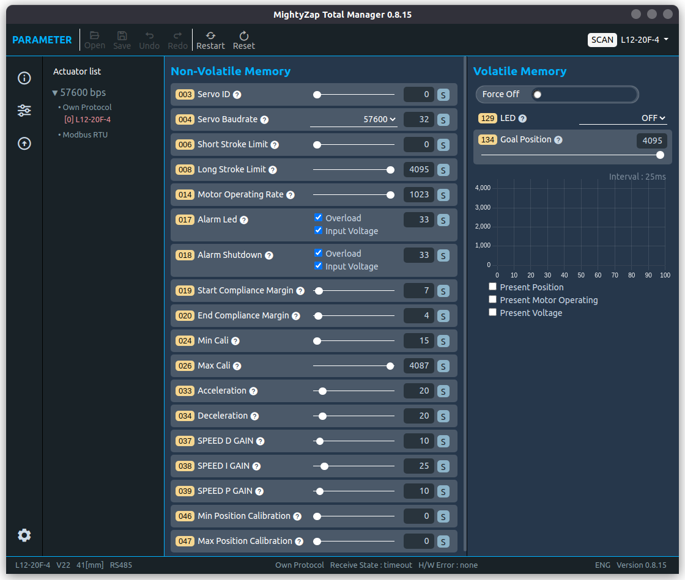

## [1. 제품 소개 ]()
mightyZap Total Manager는 다양한 운영체제에서 MightyZap을 관리 및 제어할 수 있는 Software입니다.

- MightyZap의 Parameter를 설정하고, 동작 테스트를 할 수 있습니다.
- 간단한 동작 Motion 을 테스트하고 시간에 따라 변경되는 Data를 확인할 수 있습니다.
- 다양한 Protocol을 기반으로 MightyZap을 상태 확인 및 제어 할 수 있습니다.
- 모든 Smart mightyZap의 펌웨어를 업데이트 할 수 있습니다.

MightyZap Total Manager를 구동하기 위해서는 MightyZap 서보 인터페이스 모듈을 추천드립니다.
## 1.2 지원 Protocol

- Protocol 1.0
- Modbus-RTU (FC-Only)
- CAN Protocol (BLDC Only)

**1.3** 지원 운영체제

- Windows : windows 7(32bit)
- Mac OS(지원예정)
- Linux(지원예정)
- DeskTop & lapTop에서만 테스트 되었습니다.

## 1.4 Firmware Update

Firmware는 서보모터를 구동하기위해 설치하는 Software 입니다.

Firmware는 아래와 같은 상황에 따라 Update 되며, 동작의 안정성을 위해 가급적 최신 상태로 유지할것을 권장합니다**.**

새로운 기능이 추가되거나 수정되었을 경우, 새로운 firmware가 배포됩니다.

Bug 수정이 있을 경우, 새로운 Firmware가 배포됩니다.

제품이 정상적으로 동작하지 않거나, 통신이 원할하지 않을경우, 최신 Firmware를 통해 문제가 해결 될수 있습니다.

# 2. Software Install

**2.1** 윈도우에서 설치하기

1. 윈도우즈 전용 패키지를 다운도르 합니다.

Windows Software 다운로드

2. 다운받은 설치 파일을 실행합니다.